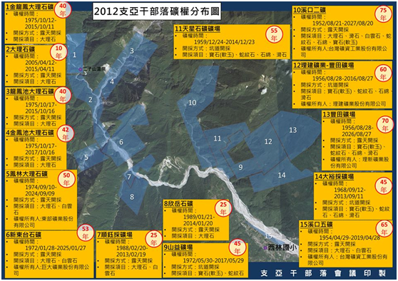

## 回應結論性意見與建議第31點

### 原住民保留地的增劃編

<ol start="106">
  <li>
在回應初次審查結論性意見與建議之國家報告（段碼92-96）中，原民會與農委會的答覆並未切題，花蓮縣豐濱鄉石梯坪土地爭議僅為相關案例之一，而非單一個案。相關部會應闡明：原住民保留地自提出申請至核准期間這段空窗期的具體權利保障措施，以及在此空窗期中土地如遭徵收或強佔的處置方式和救濟措施。
</li>

  <li>
原民會在答覆中提及「公有土地增劃編原住民保留地業務」，表達主管機關已善盡回復原住民族土地權利職責。但事實上，從2007年「補辦增劃編原住民保留地實施計畫」開辦以來，截至2014年為止僅9.2%申請案件成功取得土地，族人在申請增劃編程序中遇到的障礙和挑戰，也衍生了許多糾紛案例。33
</li>

  <li>
申請增劃編原住民保留地的程序存在許多矛盾。歷史上，多數原住民族土地是在日本殖民統治時期遭到國家暴力強制佔有及分配，1945年起接著被中華民國的政府機關或是國營企業所繼受。如今，當族人申請取回祖先的土地時，他們必須自行蒐集、提出各類土地利用證明資料，經過鄉公所、縣市政府、原民會層層審查，最後提請土地管理機關表示意見，才能決定是否核准申請。然而，作為長期既得利益者的土地管理機關（公產機關），面對可能流失土地時，自然常與族人產生對立和矛盾，或者拒絕辦理、或者甚至回過頭向族人提告。34
</li>

  <li>
一方面，原住民族世代使用祖先流傳之土地，卻因為政府採取西方財產權概念，並以地籍簿冊做為調查原住民族使用土地的唯一證據，導致原住民族因沒有文字記錄的使用規範，而難以證明其有土地的排他使用權或所有權。另一方面，既然政策的美意是要把土地歸還給原有主人，為何還要在作業程序中製造土地管理機關與族人之間的矛盾？而主管機關原民會在遇到此類糾紛時也不具有法律上明確的決定權，僅能不斷的居間「協調」，當土地管理機關不願讓步時，原民會便無計可施。35
</li>

  <li>
上述族人在增劃編程序中面臨到的困境，已不當剝奪原住民族對於保留地的排他使用權限，更突顯了漢人法律歧視原住民族傳統慣習的長久問題。我們要求：

    <ol>
      <li>
申請增劃編原住民保留地的作業程序需詳盡檢討、調整，只要族人能依據傳統知識基礎提出土地確實為其耕作、利用的事實，即可取得所有權。
</li>

      <li>
原住民保留地若已被認定有實際利用事實並符合相關規範，則應由行政院進行跨部會協商，直接將該筆土地從土地管理機關收回，再移轉至原住民保留地主管機關（原民會），最後由原民會完成保留地增劃編程序，以避免原住民傳統土地落入既得利益者的財產保衛戰中。再者，我們也要求原住民保留地進入增劃編申請程序後，在增劃編完成核定前，期間應凍結土地管理機關的處分權利，作為申請到核准間空窗期的保全機制。
</li>

      <li>
最後，解決原住民族土地問題的作法，是否僅限於讓個別族人取得原住民保留地的私人所有權？這項問題，政府也應徹底反省並廣泛與原住民族對話，尋求其他形式的土地權利解決機制。
</li>
    </ol>
  </li>
</ol>

### 礦業開發與原住民族權利

<ol start="111">
  <li>
在回應初次審查結論性意見與建議之國家報告（段碼91）中，礦業開發案的定義被限縮在辦理後端礦業用地核定階段，然而，政府在前端的礦業權設定階段，卻沒有打算取得當地受影響原住民族部落的事前知情同意。此外，報告中僅以2012年至2015年受理申請核定礦業用地案件作為統計範圍，而沒有逐一檢視台灣現存254座礦場到底有多少位於原住民族土地、影響多少部落？國家報告更錯誤地適用《原住民族基本法》第21條規定，認為應為徵得原住民族主管機關同意始得採礦，完全忽略該條所規定知情並同意的主體是「原住民族或部落」。
</li>

  <li>
從上述國家報告的回應內容，可以得知：經濟部礦務局或原民會根本不清楚到底有多少礦場位於原住民保留地或傳統領域、對原住民族又造成多少衝擊？礦務局與原民會並未重視礦業對原住民族土地及資源自治管理權利的影響，連最基礎的資料都沒有掌握。事實上，僅僅是在花蓮縣萬榮鄉的太魯閣族支亞干部落一地，其傳統領域內就存在著15處礦場，其中8處的礦權如今仍然有效（詳見附圖）。

    <figure>
      
      <figcaption>圖表1: 支亞干部落礦權分布圖（製圖：支亞干部落會議）</figcaption>
    </figure>

  </li>

  <li>
從《礦業法》的角度來看，在申請採礦過程中，如果礦場與原住民保留地或傳統領域範重疊時，該法並未賦予原住民族行使同意權的權利，假使族人不是原住民保留地所有權人，甚至連表達意見的機會都沒有。只有在少數案件的「礦業用地核定」階段中，因礦業權者新申請礦業用地、或擴大礦業用地而依據《環境影響評估法》必須進行環評程序時，原民會與原住民族才勉強有參與會議、表示意見的機會，但縱使未經當地原住民族同意，主管機關還是可以核定礦業用地，讓業者進行探採礦行為。再者，關於「取得土地使用權」的部分，如果礦業用地屬於私有原住民保留地，依照《礦業法》第47條的規定，擁有礦權的業者竟然可以在原住民不同意出租或出賣保留地的情形下，將租金提存法院後，違反族人的意願而使用該處保留地。
</li>

  <li>
透過上述法規疏漏，業者可以輕易規避部落依據《原住民族基本法》擁有的防禦權利。業者自原住民族地區採礦販售獲利，卻任由族人承受其環境與社會成本，危及部落存亡。例如，宜蘭南澳地區在政府政策支持下有多處土地開發礦業，這些需要大規模變動地景地貌的大理石、白雲石等礦場集中在東澳北溪、南澳北溪上游與澳花部落周邊，導致水土保持不易、河川係數激增、生態爭議與環境汙染等問題。礦場隨意堆置礦渣土石造成溪流淤塞、土石流及山崩之危險，對當地環境與族群生存權利更是造成極大威脅。上述種種現象，明顯違背了ICESCR第1條第2項尊重原住民族自由處置其天然財富及資源的權利。
</li>

  <li>
我們要求，未來所有在原住民族土地（包括原住民保留地與傳統領域）的開發案，都應依照《原住民族基本法》第21條及《諮商取得原住民族部落同意參與辦法》取得原住民族同意後才能進行開發。在礦業資源治理方面，經濟部礦務局更應積極依據《原住民族基本法》第22條規定與原住民族成立共同管理機制。最後，原住民族在原住民土地上基於傳統文化、祭儀或自用採取礦石，而非從事營利行為者，無須申辦礦業權等程序，並應除罪化，以示對原住民族土地與自然資源權利的尊重。
</li>
</ol>

-----

<ol start="33">
  <li>資料來自原民會的數據，轉引自原住民族電視台的報導：〈<a href="https://youtu.be/0E3jHq9Hd7A" target="_blank">增劃編年底截止，核定率不滿一成</a>〉，2014年11月24日。</li>
  <li>2013年底爆發的台灣大學梅峰農場衝突事件即是一例：賽德克族族人依據行政院核定的「補辦增劃編原住民保留地實施計畫」，申請將長年耕種、居住的土地登記為原住民保留地。然而，土地管理機關台灣大學接獲申請資料後，不但直接拒絕，還依據《民法》向族人提出「拆屋還地」及「不當得利」的訴訟，引起族人激烈抗爭。事件始末詳見：阮俊達，2015，《台灣原住民族運動的軌跡變遷（1983-2014）》，台北：國立台灣大學社會學研究所碩士論文。頁152-161。</li>
  <li>常見的糾紛還包括：當保留地申請案件還在審查階段時，土地管理機關為了規避增劃編的義務，於是快速處分該筆土地或申請各類型計畫作為他用。花蓮豐濱鄉石梯坪土地爭議即是最典型的案例：1990年到1993年間，族人向鄉公所申請登錄原住民保留地，但1993年國有財產局卻將土地移撥給「東部海岸國家風景區管理處」，1996年到1999年間族人再次向交通部陳情時，交通部的回應是這個地方已經是石梯坪秀姑巒風景特定區，依規定「不與放領」。</li>
</ol>
